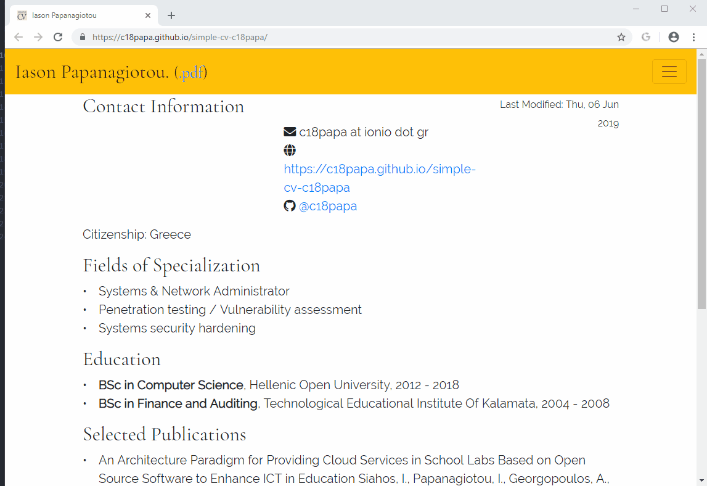

# Συνεργατικές εφαρμογές

*  Ονοματεπώνυμο: **Ιάσων - Ιωάννης Παπαναγιώτου**
*  Αριθμός Μητρώου: **ΠΚΜ201801**

***
_Σχετικά με τα παραδοτέα 1Α, 1Γ, 2ΑΒ_:

Το branch gh-pages περιέχει τον αρχικό κώδικα της σελίδας του βιβλίου και τις επιπλέον αλλαγές για την υλοποίηση των παραδοτέων. Λόγω του [jekyll bug](https://github.com/mibook/gr/issues/55) δημιουργήθηκε ένα branch στο οποίο έχουν γίνει επιπλέον αλλαγές στον κώδικα της σελίδας του βιβλίου έτσι ώστε να μπορεί να γίνεται build το site (επιλέχθηκε το συγκεκριμένο branch στα settings-github pages).
***

## Παραδοτέο Α (Συπλήρωση Βιογραφικού)

Για την υλοποίηση του συγκεκριμένου παραδοτέου, αρχικά πραγματοποιήθηκε fork του https://github.com/sharu725/online-cv από τα προτεινόμενα παραδείγματα. Στη συνέχεια πραγματοποιήθηκε η δημιουργία των branches develop, gh-pages.  Χρησιμοποιήθηκε το branch develop για τις απαραίτητες αλλαγές στο `data.yml` και `_config.yml`. Με την ολοκλήρωση των αλλαγών πραγματοποιήθηκε  Merge pull request από το branch develop στο branch gh-pages.
*  [Η σελίδα του βιογραφικού](https://c18papa.github.io/c18papa-cv/)
*  [Αποθετήριο του κώδικα του βιογραφικού](https://github.com/c18papa/c18papa-cv/tree/gh-pages)

## Παραδοτέο 1Α

Για την υλοποίηση του συγκεκριμένου παραδοτέου, αρχικά πραγματοποιήθηκε fork του https://github.com/mibook/gr. Στη συνέχεια έγινε η δημιουργία των νέων αρχείων .md στο φάκελο `_gallery` και η προσθήκη των αντίστοιχων νέων εικόνων στο φάκελο `images`. Επίσης έγιναν μικρές αλλαγές στο αρχείο _config.yml ώστε να μπορέσουμε να δούμε πως εμφανίζονται οι εικόνες στη σελίδα.

*  [Η σελίδα του βιβλίου με τις επιπλέον εικόνες](https://c18papa.github.io/gr/)
*  [Αποθετήριο του κώδικα του παραδοτέου](https://github.com/c18papa/gr)
*  [Εικόνα 1](https://github.com/c18papa/gr/blob/gh-pages/_gallery/tux.md)
*  [Εικόνα 2](https://github.com/c18papa/gr/blob/gh-pages/_gallery/beastie.md)
*  [Εικόνα 3](https://github.com/c18papa/gr/blob/gh-pages/_gallery/defcon.md)
*  [Εικόνα 4](https://github.com/c18papa/gr/blob/gh-pages/_gallery/amiga.md)
*  [Εικόνα 5](https://github.com/c18papa/gr/blob/gh-pages/_gallery/esp8266.md)

## Παραδοτέο 1Α*2

*  [Εικόνα 1](https://github.com/c18papa/gr/blob/gh-pages/_gallery/vi.md)
*  [Εικόνα 2](https://github.com/c18papa/gr/blob/gh-pages/_gallery/slack.md)
*  [Εικόνα 3](https://github.com/c18papa/gr/blob/gh-pages/_gallery/wireframes.md)
*  [Εικόνα 4](https://github.com/c18papa/gr/blob/gh-pages/_gallery/appinventor.md)
*  [Εικόνα 5](https://github.com/c18papa/gr/blob/gh-pages/_gallery/google_duplex.md)

## Παραδοτέο 1Γ (μια νέα βιογραφία)

Για την υλοποίηση του συγκεκριμένου παραδοτέου, πραγματοποιήθηκε δημιουργία νέων αρχείων .md στο φάκελο `_biography` και η προσθήκη των αντίστοιχων εικόνων (συμπεριλαμβανομένων thumbnails) στο φάκελο `images`.

*  [Αποθετήριο του κώδικα του παραδοτέου](https://github.com/c18papa/gr)
*  [alan-turing.md](https://github.com/c18papa/gr/blob/gh-pages/_biography/alan-turing.md)
*  [bio-turing.md](https://github.com/c18papa/gr/blob/gh-pages/_biography/bio-turing.md)

## Παραδοτέα 2ΑΒ

Για την υλοποίηση των συγκεκριμένων παραδοτέων, αρχικά πραγματοποιήθηκε δημιουργία νέου αρχείου `twitter.html` στο φάκελο `_includes` που περιέχει τμήμα κώδικα για την εμφάνιση twitter stream στη σελίδα του βιβλίου και παραμετροποιήθηκε το αρχείο `index.md` ώστε να γίνεται include. Επιπλέον, προστέθηκε το αρχείο [social-share.html](https://github.com/mmistakes/minimal-mistakes/blob/master/_includes/social-share.html) στο φάκελο `_includes` και έγινε επεξεργασία του αρχείου `_config.yml` όπου προστέθηκε ο λογαριασμός του twitter και η οδηγία `share: true`. Με τον τρόπο αυτό υπάρχει δυνατότητα [sharing σε Twitter, Facebook, LinkedIn](https://raw.githubusercontent.com/c18papa/blob/master/share_buttons.png).

*  [Αποθετήριο του κώδικα του παραδοτέου](https://github.com/c18papa/gr)
*  [Η σελίδα του βιβλίου με twitter stream](https://c18papa.github.io/gr/)
*  [Ενδεικτική σελίδα του βιβλίου με social sharing](https://c18papa.github.io/gr/gallery/architecture-model/)
*  [Λογαριασμός Twitter](https://twitter.com/c18papa)
*  [Στατιστικά λογαριασμού Twitter (*ενημέρωση 5/6/2019*)](https://github.com/c18papa/blob/blob/master/tweet_activity_metrics_c18papa.csv)

## Οδηγός σπουδών τμήματος

Για την υλοποίηση του συγκεκριμένου παραδοτέου, πραγματοποιήθηκε fork του αποθετηρίου `ioniodi/study-guide` και στη συνέχεια δημιουργία του branch `201801-develop`. Δημιουργήθηκαν και επιλύθηκαν τα ακόλουθα Issues μέσω αιτημάτων ενσωμάτωσης:

* [Issue #14](https://github.com/ioniodi/study-guide/issues/14), [σχετικό αρχείο](https://github.com/ioniodi/study-guide/blob/master/_msc/mob-computing-and-apps.md)
* [Issue #22](https://github.com/ioniodi/study-guide/issues/22), [σχετικό αρχείο](https://github.com/ioniodi/study-guide/blob/master/_msc/security-and-privacy-policies.md)
* [Issue #23](https://github.com/ioniodi/study-guide/issues/23), [σχετικό αρχείο](https://github.com/ioniodi/study-guide/blob/master/_msc/bioinformatics.md)
* [Issue #42](https://github.com/ioniodi/study-guide/issues/42), [σχετικό αρχείο](https://github.com/c18papa/study-guide/blob/201801-develop/_intro/corfu-and-the-ionian-university.md)
* [Issue #43](https://github.com/ioniodi/study-guide/issues/43), [σχετικό αρχείο](https://github.com/c18papa/study-guide/blob/201801-develop/_intro/faculties-and-departments.md)

## Παραδοτέο Συπλήρωση Βιογραφικού B
Αρχικά πραγματοποιήθηκε εγκατάσταση των εργαλείων Git, Pandoc, MiKTeX και Atom. Στη συνέχεια πραγματοποιήθηκε fork του αποθετηρίου https://github.com/plain-plain-text/simple-cv. Κατόπιν με την ακόλουθη εντολή έγινε clone του αποθετηρίου τοπικά:

```
git clone https://github.com/c18papa/simple-cv-c18papa.git
```
Στη συνέχεια έγιναν οι απαραίτητες αλλαγές στα αρχεία των φακέλων metadata, sections, sections.txt.
Με την εκτέλεση της εντολής `sh process.sh` γίνεται η δημιουργία των αρχέιων .pdf, .html, .tex

Ο συγχρονισμός με το αποθετήριο στο github πραγματοποιήθηκε με τις ακόλουθες εντολές:

Update local repository από το github repo:
```
git pull origin master
```
Προσθήκη των νέων και τροποποιημένων αρχείων σε staging:
```
git add -A
```
Commit αλλαγών:
```
git commit -m "commit message"
```
Push του branch master στο github repo:
```
git push origin master
```
*  [Η σελίδα του βιογραφικού](https://c18papa.github.io/simple-cv-c18papa/)
*  [Αποθετήριο του κώδικα του βιογραφικού](https://github.com/c18papa/simple-cv-c18papa)



## Παραδοτέο Συπλήρωση Βιογραφικού B (δεύτερη προσπάθεια με CI)

Αρχικά πραγματοποιήθηκε fork του αποθετηρίου https://github.com/davewhipp/markdown-cv. Στη συνέχεια έγινε επεξεργασία του αρχείου index.md για τη συμπλήρωση των στοιχείων του βιογραφικού.

Για την αυτόματη δημιουργία και τοποθέτηση του βιογραφικού σε μορφή PDF με χρήση Continuous Integration έγιναν οι παρακάτω ενέργειες:

* Εγγραφή στη σελίδα Travis CI
* Ενεργοποίηση integration για το αποθετήριο του βιογραφικού σύμφωνα με τις [οδηγίες](https://travis-ci.org/getting_started)
* Δημιουργία αρχείου [travis.yml](https://github.com/c18papa/markdown-cv-c18papa/blob/master/.travis.yml) - οδηγιών για το Travis (τι βήματα να εκτελέσει)
* Δημιουργία αρχείου [deploy.sh](https://github.com/c18papa/markdown-cv-c18papa/blob/master/deploy.sh) που περιέχει την εντολή για τη δημιουργία Pdf.
* Δημιουργία αρχείου [push.sh](https://github.com/c18papa/markdown-cv-c18papa/blob/master/push.sh) που περιέχει οδηγίες τι να εκτελεστεί μετά τη δημιουργία του Pdf. Πρακτικά τοποθετεί το Pdf αρχείο στο αποθετήριο. Επιπλέον προσθήκη της οδηγίας skip στο commit message για αποφυγή ατέρμονων builds σύμφωνα με τις [οδηγίες](https://docs.travis-ci.com/user/customizing-the-build/#skipping-a-build).
- Διασύνδεση Travis με GitHub ώστε να μπορεί να κάνει push στο αποθετήριο σύμφωνα με τις [οδηγίες](https://docs.travis-ci.com/user/deployment/pages/#setting-the-github-token)
   - Δημιουργία personal access token  σύμφωνα με τις [οδηγίες](https://help.github.com/articles/creating-an-access-token-for-command-line-use/)
   - Προσθήκη του token στη μεταβλητή GITHUB_TOKEN  σύμφωνα με τις [οδηγίες](https://docs.travis-ci.com/user/environment-variables#defining-variables-in-repository-settings)


*  [Η σελίδα του βιογραφικού](https://c18papa.github.io/markdown-cv-c18papa/)
*  [Αποθετήριο του κώδικα του βιογραφικού](https://github.com/c18papa/markdown-cv-c18papa)
*  [Αποθετήριο στο Travis](https://travis-ci.org/c18papa/markdown-cv-c18papa) [](https://travis-ci.org/c18papa/markdown-cv-c18papa)


